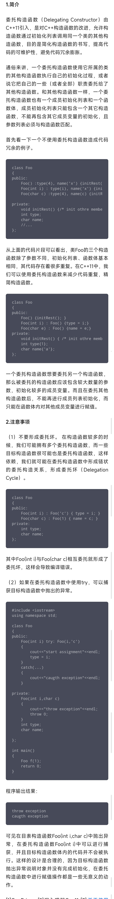

1、新增 ubuntu 下的 C++ 获取系统时间和使用 fstream （文件流）将数据输出到文件中 。 ---2022.0325

2、更新 深蓝学院 chapter1《C++初探》 的关键点、代码、ppt及注释。 --- 2022.0502

3、更新 深蓝学院 chaptor2 《对象与基本类型》的关键点、代码、ppt及注释，并提交了作业。   -------2022.0509

4、更新 深蓝学院 chapter3 《数组 vector 与字符串》 的关键点、代码、ppt及注释，这一章节没有作业    -------2022.0513

5、更新 语句、循环部分，其中 **达夫设备** 这个暴力求解的优化方法挺有趣的。       ------- 2022.07.03

6、更新函数的参数、函数体、返回值和重载与重载的解析。    ------- 2022.07.05

5、更新委托构造函数的用法，减少代码冗余。  

